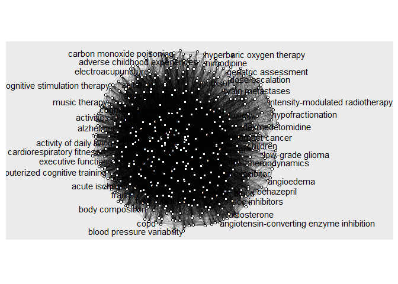
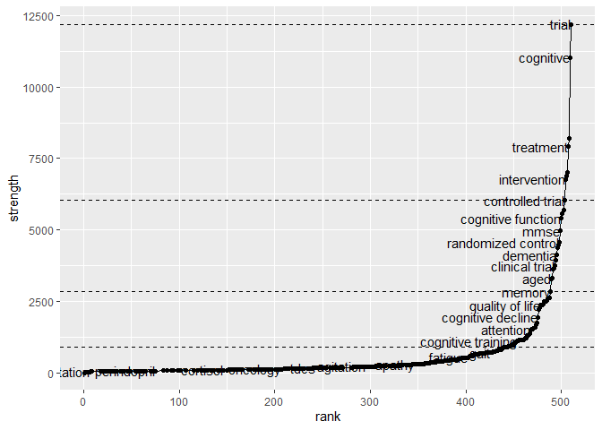

```
## 
## Attaching package: 'dplyr'
```

```
## The following objects are masked from 'package:stats':
## 
##     filter, lag
```

```
## The following objects are masked from 'package:base':
## 
##     intersect, setdiff, setequal, union
```

```
## 
## Attaching package: 'igraph'
```

```
## The following objects are masked from 'package:dplyr':
## 
##     as_data_frame, groups, union
```

```
## The following objects are masked from 'package:stats':
## 
##     decompose, spectrum
```

```
## The following object is masked from 'package:base':
## 
##     union
```

```
## Loading required package: ggplot2
```

# Overall search approach:

There are two fundamental terms to link: 

1) Terms describing a selection of cognitive screens (predefined by [Alzheimer's Society Cognitive Assessment Toolkit (pdf)](https://www.alz.org/getmedia/9687d51e-641a-43a1-a96b-b29eb00e72bb/cognitive-assessment-toolkit))
2) A set of terms that relate to chronic or clinically measurable pain

THe first terms are fairly clear but must be accompanied by a broader term that surfaces articles that may use one or more cognitive screens but not mention which in title/abstract
The second terms may especially benefit from considering further linked terms.


# Cognitive screen search terms


I'm drawing from a shortlist which contains names and abbreviations. Firstly, pull into R and remove n/a's in abbreviations (NB clunky):


Next put them into a readable form, separated by ORs.


```r
screen_all_names<- str_flatten(all_names,"\" OR \"")
screen_abbreviations<- str_flatten(all_abbrevs,"\" OR \"")
screen_referents <- str_c("\"", "cognitive screen*",  "\" OR \"", screen_all_names, "\" OR \"", screen_abbreviations, "\"")
 writeLines(screen_referents)
```

```
## "cognitive screen*" OR "Addenbrooke's Cognitive Examination" OR "Addenbrooke's Cognitive Examination Revised" OR "Mini-ACE" OR "Abbreviated Mental Test" OR "Mini-Cog" OR "Addenbrooke's Cognitive Examination - III" OR "Montreal Cognitive Assessment" OR "Mini Mental State Examination" OR "6-item cognitive impairment test" OR "Hopkins Verbal Learning Test" OR "Hopkins Verbal Learning Test Revised" OR "Test for the early detection of dementia" OR "Test your memory test" OR "AMTS" OR "ACE-3" OR "ACE" OR "ACE-R" OR "M-ACE" OR "AMT" OR "Mini-Cog" OR "ACE-III" OR "MoCA" OR "MMSE" OR "6CIT" OR "HVLT" OR "HVLT-R" OR "TE4D-Cog" OR "TYM"
```

The provisional search terms are thus: 

"cognitive screen*" OR "Addenbrooke's Cognitive Examination" OR "Addenbrooke's Cognitive Examination Revised" OR "Mini-ACE" OR "Abbreviated Mental Test" OR "Mini-Cog" OR "Addenbrooke's Cognitive Examination - III" OR "Montreal Cognitive Assessment" OR "Mini Mental State Examination" OR "6-item cognitive impairment test" OR "Hopkins Verbal Learning Test" OR "Hopkins Verbal Learning Test Revised" OR "Test for the early detection of dementia" OR "Test your memory test" OR "AMTS" OR "ACE-3" OR "ACE" OR "ACE-R" OR "M-ACE" OR "AMT" OR "Mini-Cog" OR "ACE-III" OR "MoCA" OR "MMSE" OR "6CIT" OR "HVLT" OR "HVLT-R" OR "TE4D-Cog" OR "TYM".

These may be improved in the next stages.

# Pain terms
based on a cursory search I came up with "pain OR fibromyalgia OR migraine OR neuropathic". Hopefully we can improve this in the next stages.

# Litsearchr term identification process

To improve our search terms we can identify keywords from Litsearchr.

## 1. Conduct naive searches
Complete one or more searches of interest. This should be done in a way that produces a *.nbib file. Eg in PubMed complete your search and then select "Send To" citation manager. Put the saved file in your project folder.

SEARCH_1 I searched PubMed pain* AND cognit* AND screen* which produced 949 results. NB this deviates from the search structure outlined above as I have separated cognition and screen here - acceptable at this information-gathering stage. Also, I then decided to amend using NOT (cognit* behav* therapy) to limit  irrelevant results about CBT (659 results).

SEARCH_2 looks at cognitive screen terms using the terms identified above: "cognitive screen*" OR "Addenbrooke's Cognitive Examination" OR "Addenbrooke's Cognitive Examination Revised" OR "Mini-ACE" OR "Abbreviated Mental Test" OR "Mini-Cog" OR "Addenbrooke's Cognitive Examination - III" OR "Montreal Cognitive Assessment" OR "Mini Mental State Examination" OR "6-item cognitive impairment test" OR "Hopkins Verbal Learning Test" OR "Hopkins Verbal Learning Test Revised" OR "Test for the early detection of dementia" OR "Severe Impairment battery" OR "AMTS" OR "ACE-3" OR "SIB" OR "ACE" OR "ACE-R" OR "M-ACE" OR "AMT" OR "Mini-Cog" OR "ACE-III" OR "MoCA" OR "MMSE" OR "6CIT" OR "HVLT" OR "HVLT-R" OR "TE4D-Cog" OR "SiB7". This produced many results (nearly 37k) but restricting to clinical trials and RCTS within the last five years made it more manageable  (1132 results).

SEARCH_3 focuses  on pain terms: pain OR fibromyalgia OR migraine OR neuropathic. This produced nearly a million results so I limited to clinical trials and RCTS within the last year (2529 results).


You then pull these searches into R


```r
# Collects all the .nbib files in the wd and outputs them as dataframes
fileNames <- Sys.glob("*.nbib")
for (fileName in fileNames) {
  sample <- litsearchr::import_results(file=fileName)
  assign(paste0(tools::file_path_sans_ext(fileName)),sample)
}
```

```
## Reading file SEARCH_1.nbib ... done
## Reading file SEARCH_2.nbib ... done
## Reading file SEARCH_3.nbib ... done
```
Now choose which search to use, and define a prefix for all terms you produce that **matches that search**. 


```r
focus <-SEARCH_2
prefix <- "S2"
```

In this example: *search 2*, for cognitive-screen terms.

## 2. Use litsearchr to collate keywords

We can have a look at the keywords, the function takes the dataset, 


```r
keywords <-term_extractor(focus,1,3)
```

```
## Loading required namespace: stopwords
```

```r
update_name(keywords)
```

## Collating search title content

A bit more to do here as titles can contain many "stopwords" that are not informative to the topic of the article. I have begun to build a tentative stopword list at SR_stopwords.txt 


```r
SR_stopwords <- read_lines("SR_stopwords.txt")
all_stopwords <- c(get_stopwords("English"), SR_stopwords)
```


```r
titles<- get_best_titles(focus)
update_name(titles)
```

We can combine these useful title terms with keywords, removing duplicates:

```r
terms <- unique(c(update_name(keywords), update_name(titles))) # note this continues to call the renaming function to make sure we are pointing to the most updated version, rather than the generic "keywords" - avoiding losing information if eg S1_keywords has been amended since
update_name(terms)
```


### Network analysis of content

We can create and visualise our content: 

```r
network <- create_the_network(focus,update_name(terms))
update_name(network)
print_the_network(update_name(network))
```

<!-- -->

We can now visualise this:


And find the strongest links in the network (note later entries have a stronger link):


```r
net_strengths <- strengths_of_network(update_name(network))
update_name(net_strengths)
```


This can then be plotted against changepoints (where the network strength shifs, a bit like an eigenvalue)


```r
net_outputs<- find_network_cutoffs(update_name(net_strengths), update_name(network))
cutoff <- unlist(net_outputs[1])
update_name(cutoff)
net_outputs[2]
```

```
## [[1]]
```

<!-- -->

By selecting one of these changepoints the set of title-derived keywords can be reduced down:


```r
cutoff_level <- 1 # NB set this explicitly higher or lower, it will be recorded elsewhere.
network_levels <- paste("Network cutoff for",prefix, "is", cutoff_level)
write(network_levels,"network_levels.txt")
net_redux <- reduce_graph(update_name(network), cutoff[cutoff_level]) 
selected_terms <- get_keywords(net_redux)
selected_terms
```

```
##  [1] "ace"                           "activities of daily living"   
##  [3] "aged"                          "aging"                        
##  [5] "alzheimer's disease"           "angiotensin-converting enzyme"
##  [7] "attention"                     "balance"                      
##  [9] "biomarker"                     "blood pressure"               
## [11] "brain"                         "cancer"                       
## [13] "cardiovascular"                "clinical trial"               
## [15] "cognition"                     "cognitive"                    
## [17] "cognitive decline"             "cognitive dysfunction"        
## [19] "cognitive function"            "cognitive functions"          
## [21] "cognitive impairment"          "cognitive training"           
## [23] "community-dwelling"            "dementia"                     
## [25] "depression"                    "diabetes"                     
## [27] "efficacy"                      "elderly"                      
## [29] "executive function"            "exercise"                     
## [31] "intervention"                  "mci"                          
## [33] "memory"                        "mild cognitive impairment"    
## [35] "mini-mental state examination" "mini mental state examination"
## [37] "mmse"                          "moca"                         
## [39] "montreal cognitive assessment" "mortality"                    
## [41] "mri"                           "older adults"                 
## [43] "outcome"                       "prevention"                   
## [45] "quality of life"               "randomised controlled trial"  
## [47] "randomized controlled trial"   "randomized trial"             
## [49] "rct"                           "rehabilitation"               
## [51] "safety"                        "stroke"                       
## [53] "surgery"                       "survival"                     
## [55] "systolic"                      "treatment"                    
## [57] "trial"                         "controlled trial"             
## [59] "converting enzyme"             "daily living"                 
## [61] "elderly patients"              "mini-mental state"            
## [63] "placebo-controlled trial"      "randomized clinical"          
## [65] "randomized clinical trial"     "randomized control"           
## [67] "randomized controlled"         "state examination"
```

```r
update_name(selected_terms)
```

### find some way of connecting this back with the keywords
The Tudge walkthrough doesn't discuss this. But it seems that we have  information from the keywords that hasn't been involved in the network analysis, but we don't want to discard. Lacking expertise, the simplest thing would be to combine these with the title-derived selected terms just produced. (Also add in some starred terms from the original approach).

These then are combined into a text output for manual review and to be placed into 


```r
longlist <- unique(c(update_name(keywords), update_name(selected_terms)))

readr::write_lines(longlist, paste0(prefix, "_possible_terms",".txt"))
```


