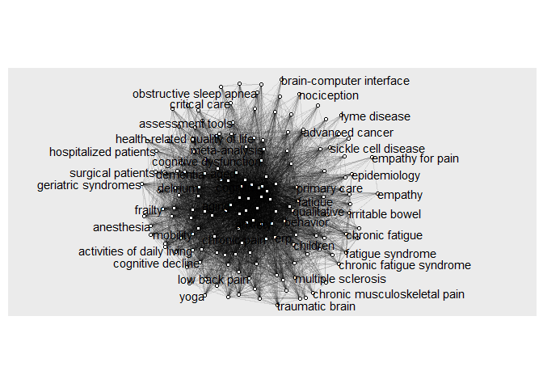

# Using litsearchr

```r
library(dplyr)
library(readr)
library(igraph)
library(litsearchr)
library(ggraph)
library(stringr)
packageVersion("litsearchr")
```

```
## [1] '1.0.0'
```


## Completing the naive search

I put into PubMed pain* AND cognit* and screen* which produced 949 results.
Variant search: using NOT (cognit* behav* therapy) to limit the irrelevant results (659)
I then put this into litsearchr


```r
naive_results <- import_results(file="pubmed-painANDcog-set_no_CBT.nbib")
```

```
## Reading file pubmed-painANDcog-set_no_CBT.nbib ... done
```

```r
nrow(naive_results)
```

```
## [1] 659
```
## Collating search keywords
We can then have a look at the keywords - here limited to those that appear in 3 or more papers


```r
keywords <- extract_terms(keywords=naive_results[, "keywords"], method="tagged", min_n=1, min_freq = 3)
```

```
## Loading required namespace: stopwords
```

## Collating search title content

A bit more to do here as titles can contain many "stopwords" that are not informative to the topic of the article. I have begun to build a tentative stopword list at SR_stopwords.txt 


```r
SR_stopwords <- read_lines("SR_stopwords.txt")
all_stopwords <- c(get_stopwords("English"), SR_stopwords)
```


```r
title_terms <- extract_terms(
  text=naive_results[, "title"],
  method="fakerake",
  min_freq=3, min_n=2,
  stopwords=all_stopwords
)

title_terms
```

```
##  [1] "advanced cancer"               "advanced cancer patients"     
##  [3] "anxiety symptoms"              "assessment tools"             
##  [5] "bowel syndrome"                "brain-computer interface"     
##  [7] "brain injury"                  "breast cancer"                
##  [9] "cancer patients"               "cancer survivors"             
## [11] "chronic fatigue"               "chronic fatigue syndrome"     
## [13] "chronic musculoskeletal"       "clinical trial"               
## [15] "cognitive decline"             "cognitive dysfunction"        
## [17] "cognitive function"            "cognitive impairment"         
## [19] "cognitive performance"         "cognitive screening"          
## [21] "cognitive symptoms"            "cognitively impaired"         
## [23] "cognitively intact"            "colorectal cancer"            
## [25] "controlled trial"              "coping strategies"            
## [27] "depression inventory"          "elderly patients"             
## [29] "elderly people"                "emergency department"         
## [31] "fatigue syndrome"              "fibromyalgia syndrome"        
## [33] "geriatric syndromes"           "health-related quality"       
## [35] "health screening"              "health status"                
## [37] "hospitalized patients"         "hyperactivity disorder"       
## [39] "irritable bowel"               "irritable bowel syndrome"     
## [41] "lupus erythematosus"           "mental health"                
## [43] "mixed methods"                 "multiple sclerosis"           
## [45] "non-motor symptoms"            "nursing homes"                
## [47] "obstructive sleep"             "obstructive sleep apnea"      
## [49] "older adult"                   "older adults"                 
## [51] "older patients"                "older people"                 
## [53] "older women"                   "patient-controlled analgesia" 
## [55] "perioperative assessment"      "postoperative cognitive"      
## [57] "postoperative delirium"        "posttraumatic stress"         
## [59] "posttraumatic stress disorder" "preoperative cognitive"       
## [61] "primary total"                 "prospective cohort"           
## [63] "prospective observational"     "prostate cancer"              
## [65] "psychological factors"         "psychometric properties"      
## [67] "psychosocial factors"          "quality improvement"          
## [69] "randomized controlled"         "randomized controlled trial"  
## [71] "rapid screening"               "replacement surgery"          
## [73] "rheumatic diseases"            "screening tools"              
## [75] "sleep apnea"                   "sleep disturbance"            
## [77] "stress disorder"               "surgical patients"            
## [79] "symptom assessment"            "symptom screening"            
## [81] "systematic literature"         "systemic lupus"               
## [83] "systemic lupus erythematosus"  "traumatic brain"              
## [85] "traumatic brain injury"
```

We can combine these useful title terms with keywords, removing duplicates:

```r
terms <- unique(c(keywords, title_terms))
```


### Network analysis of content

```r
docs <- paste(naive_results[, "title"], naive_results[, "abstract"])
dfm <- create_dfm(elements=docs, features=terms)
g <- create_network(dfm, min_studies=1)
```

We can now visualise this:


```r
network_vis<-ggraph(g, layout="stress") +
     coord_fixed() +
     expand_limits(x=c(-3, 3)) +
     geom_edge_link(aes(alpha=weight)) +
     geom_node_point(shape="circle filled", fill="white") +
     geom_node_text(aes(label=name), hjust="outward", check_overlap=TRUE) +
     guides(edge_alpha=FALSE)
network_vis
```

<!-- -->

And find the strongest links in the network (note later entries have a stronger link):


```r
strengths <- strength(g)

data.frame(term=names(strengths), strength=strengths, row.names=NULL) %>%
  mutate(rank=rank(strength, ties.method="min")) %>%
  arrange(strength) ->
  term_strengths

term_strengths
```

```
##                                   term strength rank
## 1                     empathy for pain       21    1
## 2             brain-computer interface       21    1
## 3                         lyme disease       23    3
## 4                              empathy       27    4
## 5         patient-controlled analgesia       30    5
## 6                    symptom screening       32    6
## 7                          nociception       33    7
## 8                   non-motor symptoms       34    8
## 9                      prostate cancer       34    8
## 10        systemic lupus erythematosus       36   10
## 11                 lupus erythematosus       36   10
## 12                      systemic lupus       36   10
## 13                     rapid screening       38   13
## 14                        epidemiology       40   14
## 15               fibromyalgia syndrome       43   15
## 16                       primary total       44   16
## 17                     pain perception       45   17
## 18             obstructive sleep apnea       47   18
## 19                 sickle cell disease       47   18
## 20                         sleep apnea       47   18
## 21                       mixed methods       49   21
## 22                  rheumatic diseases       49   21
## 23                       critical care       51   23
## 24            perioperative assessment       51   23
## 25                 replacement surgery       52   25
## 26                                yoga       53   26
## 27                         older women       54   27
## 28                qualitative research       57   28
## 29               hospitalized patients       59   29
## 30        chronic musculoskeletal pain       64   30
## 31             chronic musculoskeletal       64   30
## 32                   colorectal cancer       65   32
## 33                   obstructive sleep       66   33
## 34              hyperactivity disorder       71   34
## 35                  cognitive symptoms       78   35
## 36            advanced cancer patients       82   36
## 37           prospective observational       82   36
## 38                  cognitively intact       84   38
## 39                             suicide       86   39
## 40                       breast cancer       89   40
## 41            chronic fatigue syndrome       92   41
## 42                      elderly people       92   41
## 43                    fatigue syndrome       92   41
## 44                      scoping review       94   44
## 45                    health screening       97   45
## 46           patient-reported outcomes       98   46
## 47                    anxiety symptoms       98   46
## 48                        hip fracture       99   48
## 49                     irritable bowel       99   48
## 50            irritable bowel syndrome       99   48
## 51              traumatic brain injury       99   48
## 52          magnetic resonance imaging      101   52
## 53                      bowel syndrome      103   53
## 54                     chronic fatigue      104   54
## 55                    cancer survivors      105   55
## 56                     advanced cancer      108   56
## 57                 quality improvement      109   57
## 58                  multiple sclerosis      113   58
## 59                       nursing homes      114   59
## 60                     traumatic brain      117   60
## 61                  symptom assessment      119   61
## 62                            migraine      121   62
## 63                 geriatric syndromes      121   62
## 64  comprehensive geriatric assessment      126   64
## 65                          anesthesia      130   65
## 66       posttraumatic stress disorder      131   66
## 67                    neuropathic pain      133   67
## 68                          prediction      134   68
## 69                   surgical patients      135   69
## 70                emergency department      138   70
## 71                        brain injury      139   71
## 72                    assessment tools      147   72
## 73               systematic literature      149   73
## 74                   coping strategies      154   74
## 75           mild cognitive impairment      156   75
## 76                                knee      157   76
## 77             postoperative cognitive      157   76
## 78                posttraumatic stress      157   76
## 79               psychological factors      159   79
## 80                depression inventory      161   80
## 81                psychosocial factors      161   80
## 82                       low back pain      163   82
## 83                   physical activity      179   83
## 84                cognitively impaired      180   84
## 85              preoperative cognitive      182   85
## 86                             opioids      195   86
## 87                     stress disorder      205   87
## 88                 cognitive screening      210   88
## 89                     pain assessment      220   89
## 90                         feasibility      221   90
## 91             psychometric properties      224   91
## 92              postoperative delirium      230   92
## 93                  prospective cohort      233   93
## 94                     palliative care      234   94
## 95                       health status      247   95
## 96                    elderly patients      248   96
## 97      health-related quality of life      256   97
## 98              health-related quality      256   97
## 99                        fibromyalgia      273   99
## 100         activities of daily living      278  100
## 101                      meta-analysis      284  101
## 102                     older patients      287  102
## 103                  cognitive decline      289  103
## 104                       older people      298  104
## 105                    cancer patients      298  104
## 106                       primary care      306  106
## 107                             stroke      314  107
## 108              cognitive performance      315  108
## 109                            frailty      320  109
## 110                        qualitative      322  110
## 111                  sleep disturbance      328  111
## 112                           children      335  112
## 113                      mental health      354  113
## 114                     clinical trial      357  114
## 115        randomized controlled trial      360  115
## 116                              falls      366  116
## 117                    screening tools      387  117
## 118              randomized controlled      393  118
## 119                           mobility      422  119
## 120              cognitive dysfunction      426  120
## 121                         prevention      438  121
## 122                             trauma      447  122
## 123                     rehabilitation      477  123
## 124                                erp      508  124
## 125                     questionnaires      508  124
## 126                           behavior      582  126
## 127                            surgery      604  127
## 128                       risk factors      621  128
## 129                            elderly      642  129
## 130                           dementia      666  130
## 131                   controlled trial      686  131
## 132                        self-report      751  132
## 133                              aging      758  133
## 134                              tools      768  134
## 135                       older adults      779  135
## 136                        older adult      813  136
## 137                           delirium      819  137
## 138                         disability      821  138
## 139                       chronic pain      825  139
## 140                  systematic review      889  140
## 141                             cancer      892  141
## 142                          diagnosis      899  142
## 143                            fatigue      977  143
## 144                 cognitive function      979  144
## 145                         prevalence     1037  145
## 146                               aged     1041  146
## 147                              sleep     1059  147
## 148                             stress     1123  148
## 149                          cognition     1211  149
## 150                    quality of life     1300  150
## 151                            anxiety     1341  151
## 152                           outcomes     1584  152
## 153                             review     1800  153
## 154               cognitive impairment     1877  154
## 155                           symptoms     1895  155
## 156                         depression     2022  156
## 157                         impairment     2405  157
## 158                         assessment     2644  158
## 159                             health     2870  159
## 160                          screening     4314  160
## 161                               pain     5164  161
## 162                          cognitive     5229  162
```


This can then be plotted against changepoints (where the network strength shifs, a bit like an eigenvalue)


```r
cutoff_fig <- ggplot(term_strengths, aes(x=rank, y=strength, label=term)) +
  geom_line() +
  geom_point() +
  geom_text(data=filter(term_strengths, rank>5), hjust="right", nudge_y=20, check_overlap=TRUE)

cutoff_change <- find_cutoff(g, method="changepoint", knot_num=3)

cutoff_fig +
  geom_hline(yintercept=cutoff_change, linetype="dashed")
```

<!-- -->

By selecting one of these changepoints the set of title-derived keywords can be reduced down:


```r
g_redux <- reduce_graph(g, cutoff_change[1]) # tweak this number to change the cutoff option
selected_terms <- get_keywords(g_redux)

selected_terms
```

```
##  [1] "aged"                 "aging"                "anxiety"             
##  [4] "assessment"           "behavior"             "cancer"              
##  [7] "chronic pain"         "cognition"            "cognitive"           
## [10] "cognitive impairment" "delirium"             "dementia"            
## [13] "depression"           "diagnosis"            "disability"          
## [16] "elderly"              "erp"                  "fatigue"             
## [19] "health"               "impairment"           "older adults"        
## [22] "outcomes"             "pain"                 "prevalence"          
## [25] "quality of life"      "questionnaires"       "review"              
## [28] "risk factors"         "screening"            "self-report"         
## [31] "sleep"                "stress"               "surgery"             
## [34] "symptoms"             "systematic review"    "tools"               
## [37] "cognitive function"   "controlled trial"     "older adult"
```

### find some way of connecting this back with the keywords
The Tudge walkthrough doesn't discuss this. But it seems that we have  information from the keywords that hasn't been involved in the network analysis, but we don't want to discard. Lacking expertise, the simplest thing would be to combine these with the title-derived selected terms just produced. (Also add in some starred terms from the original approach).

```r
longlist <- unique(c(keywords, selected_terms))

extra_terms <- c(
  "pain*",
  "cognit*",
  "screen*"
)

longlist <-c(longlist, extra_terms)
longlist
```

```
##   [1] "activities of daily living"         "advanced cancer"                   
##   [3] "aged"                               "aging"                             
##   [5] "anesthesia"                         "anxiety"                           
##   [7] "assessment"                         "behavior"                          
##   [9] "cancer"                             "cannabidiol"                       
##  [11] "children"                           "chronic migraine"                  
##  [13] "chronic musculoskeletal pain"       "chronic pain"                      
##  [15] "cognition"                          "cognitive"                         
##  [17] "cognitive decline"                  "cognitive dysfunction"             
##  [19] "cognitive frailty"                  "cognitive impairment"              
##  [21] "comprehensive geriatric assessment" "critical care"                     
##  [23] "delirium"                           "dementia"                          
##  [25] "depression"                         "diagnosis"                         
##  [27] "disability"                         "elderly"                           
##  [29] "emergency department"               "empathy"                           
##  [31] "empathy for pain"                   "epidemiology"                      
##  [33] "erp"                                "falls"                             
##  [35] "fatigue"                            "feasibility"                       
##  [37] "fibromyalgia"                       "frailty"                           
##  [39] "genome-wide association study"      "health"                            
##  [41] "health-related quality of life"     "hip fracture"                      
##  [43] "impairment"                         "knee"                              
##  [45] "low back pain"                      "lyme disease"                      
##  [47] "magnetic resonance imaging"         "mental health"                     
##  [49] "meta-analysis"                      "migraine"                          
##  [51] "mild cognitive impairment"          "mobility"                          
##  [53] "multiple sclerosis"                 "neuropathic pain"                  
##  [55] "nociception"                        "nursing homes"                     
##  [57] "obstructive sleep apnea"            "older adults"                      
##  [59] "older people"                       "opioids"                           
##  [61] "outcomes"                           "pain"                              
##  [63] "pain assessment"                    "pain perception"                   
##  [65] "palliative care"                    "parkinsonâ\200\231s disease"             
##  [67] "patient-reported outcomes"          "physical activity"                 
##  [69] "postoperative delirium"             "prediction"                        
##  [71] "prevalence"                         "prevention"                        
##  [73] "primary care"                       "qualitative"                       
##  [75] "qualitative research"               "quality of life"                   
##  [77] "questionnaires"                     "rehabilitation"                    
##  [79] "review"                             "risk factors"                      
##  [81] "scoping review"                     "screening"                         
##  [83] "self-report"                        "sickle cell disease"               
##  [85] "sleep"                              "stress"                            
##  [87] "stroke"                             "suicide"                           
##  [89] "surgery"                            "symptoms"                          
##  [91] "systematic review"                  "systemic lupus erythematosus"      
##  [93] "tools"                              "trauma"                            
##  [95] "yoga"                               "cognitive function"                
##  [97] "controlled trial"                   "older adult"                       
##  [99] "pain*"                              "cognit*"                           
## [101] "screen*"
```


## Grouping with litsearchr

The recommendation is to do this by hand - pick out the terms from the list and organise them under your themes.


```r
grouped_terms <-list(
  pain=longlist[c(12,13,14,37,44,45,50,54,55,62,63,99)],
 cognition=longlist[c(15:20,24,51,96,100)],
  screen=longlist[c(7,82,93,101)]
)
grouped_terms
```

```
## $pain
##  [1] "chronic migraine"             "chronic musculoskeletal pain"
##  [3] "chronic pain"                 "fibromyalgia"                
##  [5] "knee"                         "low back pain"               
##  [7] "migraine"                     "neuropathic pain"            
##  [9] "nociception"                  "pain"                        
## [11] "pain assessment"              "pain*"                       
## 
## $cognition
##  [1] "cognition"                 "cognitive"                
##  [3] "cognitive decline"         "cognitive dysfunction"    
##  [5] "cognitive frailty"         "cognitive impairment"     
##  [7] "dementia"                  "mild cognitive impairment"
##  [9] "cognitive function"        "cognit*"                  
## 
## $screen
## [1] "assessment" "screening"  "tools"      "screen*"
```


```r
# record this search into a text file
write_search(
  grouped_terms,
  languages="English",
  exactphrase=TRUE,
  stemming=FALSE, # DECISION: stem or not stem?
  closure="left",
  writesearch=TRUE
)

cat(read_file("search-inEnglish.txt"))
```


\(\("chronic migraine" OR "chronic musculoskeletal pain" OR "chronic pain" OR fibromyalgia OR knee OR "low back pain" OR migraine OR "neuropathic pain" OR nociception OR pain\) AND \(cognition OR cognitive OR dementia OR "mild cognitive impairment"\) AND \(screening\)\)


### Feeding this back in to pubmed

We get a new search, which we save in as new_results:


```r
new_results <- import_results(file="new_pubmed.nbib")
```

```
## Reading file new_pubmed.nbib ... done
```


```r
naive_results %>%
  mutate(in_new_results=title %in% new_results[, "title"]) ->
  naive_results

excluded_articles <- naive_results %>%
  filter(!in_new_results) %>%
  select(title, keywords)
```


```r
 write.csv(excluded_articles, file = "excluded_articles.csv")
```


```r
important_titles <- c(
  "Screening for pain in patients with cognitive and communication difficulties: evaluation of the SPIN-screen",
  "Pain and the Montreal Cognitive Assessment (MoCA) in Aging",
  "Disruption of cognitive function in Fibromyalgia Syndrome",
  "Cognitive Function Impairment in Patients with Neuropathic Pain Under Standard Conditions of Care",
  "Validity and reliability of the clock drawing test as a screening tool for cognitive impairment in patients with fibromyalgia",
  "Tales of the boogeyman"
)

data.frame(check_recall(important_titles, new_results[, "title"]))
```

```
##                                                                                                                           Title
## 1                   Screening for pain in patients with cognitive and communication difficulties: evaluation of the SPIN-screen
## 2                                                                    Pain and the Montreal Cognitive Assessment (MoCA) in Aging
## 3                                                                     Disruption of cognitive function in Fibromyalgia Syndrome
## 4                             Cognitive Function Impairment in Patients with Neuropathic Pain Under Standard Conditions of Care
## 5 Validity and reliability of the clock drawing test as a screening tool for cognitive impairment in patients with fibromyalgia
## 6                                                                                                        Tales of the boogeyman
##                                                                                                                       Best_Match
## 1                        Prevalence of pain in patients with cancer aged 70â\200¯years or older: A prospective observational study.
## 2                                                                    Pain and the Montreal Cognitive Assessment (MoCA) in Aging.
## 3                                                                         Evaluation of Cognitive Symptoms Following Concussion.
## 4                             Cognitive function impairment in patients with neuropathic pain under standard conditions of care.
## 5 Validity and reliability of the clock drawing test as a screening tool for cognitive impairment in patients with fibromyalgia.
## 6                                                                                                      For whom the bells knell.
##          Similarity
## 1 0.262135922330097
## 2                 1
## 3               0.4
## 4                 1
## 5                 1
## 6 0.304347826086957
```


# Population search terms
Not sure about this: do we need to specify Adult or just use in exclusion criteria?


# Pain search terms


# Cognitive screen search terms


## Raw search terms


Based on all the cognitive screens in the .csv file, we would need to search for these test names and referents.


```r
screen_full_names<- str_flatten(cog_screens$Test_Name,"\" OR \"")
screen_abbreviations<- str_flatten(abbrevsonly$Abbreviation,"\" OR \"")
screen_referents <- str_c("\"", screen_full_names, "\" OR \"", screen_abbreviations, "\"")
 writeLines(screen_referents)
```

```
## "Clinical Dementia Rating Scale" OR "Extended Scale for Dementia" OR "Category Fluency - Set Test" OR "Cognisyst" OR "Alzheimer's Staging Scale" OR "Yokota Memory Test" OR "Confusion Assessment Method" OR "Trail making Test" OR "Cognitive Section of CAMDEX" OR "Functional Assessment Test" OR "Mental Alternation test" OR "Category and Letter Fluency" OR "Cognitive Drug Research" OR "Cognitive Screening Test" OR "Ottowa Mental Status Exam" OR "Rowland Universal Dementia Assessment Scale" OR "AD8" OR "CNS Vital Signs" OR "Cog Screen" OR "Cognitive Stability Index" OR "Cognitive Stability Index" OR "Cognometer" OR "Computer-Administered Neuropsychological Screen for Mild Cognitive Impairment (NB BATTERY)" OR "Global Clinical Scale" OR "Global Deterioration Scale" OR "Halifax Mental Status Scale" OR "Interactive-Voice Recognition Dementia Screen" OR "Mattis Dementia Rating Scale" OR "Medical Care Corporation" OR "Medical Decision Logic, Inc" OR "MemTrax" OR "MicroCog" OR "Milan Overall Dementia Assessment" OR "NetMet" OR "Neurotrax" OR "CogTest" OR "Cognistat" OR "Telephone Brief Screen for Cognitive Impairment" OR "Telephone-assessed Mental State" OR "Temporal Orientation" OR "St. Louis University Mental Status Examination" OR "Three words three shapes" OR "Brief Cognitive Rating Scale" OR "AB Cognitive Screen" OR "Brief Cognitive Scale" OR "Dementia Questionnaire" OR "Deterioration Cognitive Observee" OR "Modified WORLD Test" OR "Montpelier Screen" OR "Neurobehavioral Cognitive Status Examination OR Cognistat" OR "Rotterdam Version of the Cambridge Cognitive Examination" OR "Short Memory Questionnaire" OR "Short Portable Mental Status Questionnaire" OR "Symptoms of Dementia Screener" OR "Three Word Recall" OR "Minnesota Cognitive Acuity Screen" OR "CANS-MCI" OR "Extended Mini-Mental Assessment" OR "Telephone Interview of Cognitive Status-Modified" OR "Cognosis" OR "Cogstate" OR "MMSE-telephone version" OR "Rapid Dementia Screening Test" OR "Blessed Memory Test/Category Fluency" OR "Brief Alzheimer Screen" OR "Clifton Assessment Procedures for the Elderly - Cognitive Assessment Scale" OR "Delayed Word Recall Test" OR "Efficient Office-Based Assessment of Cognition" OR "Mild cognitive impairment screen" OR "Mini-Cog" OR "Short Cognitive Evaluation Battery" OR "Short Orientation Memory Concentration Test" OR "Six Item Screener" OR "Ten-item free recall with serial position effect analysis" OR "7-Minute Screen" OR "Cognitive Abilities Screening Instrument" OR "Cognitive Assessment Screening Test" OR "DemTect" OR "Short and Sweet Screening Instrument" OR "Time and Change" OR "Clock Drawing Test- Shulman" OR "Clock Drawing Test- Sunderland" OR "Informant Questionnaire on Cognitive Decline in the Elderly - Short Form" OR "Abbreviated Mental Test" OR "General Practitioner Assessment of Cognition" OR "Verbal Fluency" OR "Modified Mini-mental state examination" OR "Addenbrooke's Cognitive Examination" OR "Alzheimer Disease Assessment Scale Cognitive Subscale" OR "Benton's Visual Retention Test" OR "Chinese Abbreviated Mild Cognitive Impairment Test" OR "Isaacs Set Test" OR "Revised Hasegawa's Dementia Scale" OR "Standardized Mini-Mental State Examination" OR "Cognitive Capacity Screening Examination" OR "Short Test of Mental Status" OR "Montreal Cognitive Assessment" OR "Informant Questionnaire on Cognitive Decline in the Elderly" OR "Memory Impairment Screen" OR "Addenbrooke's Cognitive Examination Revised" OR "Mini Mental State Examination" OR "Indiana University Telephone-Based Assessment of Neuropsychological Status" OR "IntegNeuro" OR "Hopkins Verbal Learning Test" OR "High Sensitivity Cognitive Screen" OR "Cambridge Cognitive Examination" OR "The Repeatable Battery for the Assessment of Neuropsychological Status" OR "Visual association test" OR "Mini-ACE" OR "TELE" OR "CDR" OR "TMT" OR "CAMDEX" OR "AD8" OR "DRS" OR "SLU" OR "ABCS" OR "BCS" OR "DQ" OR "DECO" OR "WORLD" OR "Mont" OR "NCSE" OR "R-CAMCOG" OR "SMQ" OR "SPMSQ" OR "SDS" OR "3WR" OR "MCAS" OR "CANS-MCI" OR "EMA" OR "TICS-M" OR "RDST" OR "BAS" OR "Mini-Cog" OR "S-OMC, 6-CIT, Short Blessed Test" OR "SIS" OR "7MS" OR "CASI" OR "CAST" OR "DemTect" OR "SASSI" OR "T&C" OR "CDT" OR "CDT" OR "IQCODE-SF" OR "AMT" OR "GPCOG" OR "3MS" OR "ACE" OR "ADAS-cog" OR "BVRT" OR "CAMCI" OR "IST" OR "HDS-R" OR "S-MMSE" OR "CCSE" OR "STMS" OR "MoCA" OR "IQCODE" OR "MIS" OR "ACE-R" OR "MMSE" OR "HVLT" OR "CAMCOG" OR "M-ACE"
```
In other words:

"Clinical Dementia Rating Scale" OR "Extended Scale for Dementia" OR "Category Fluency - Set Test" OR "Cognisyst" OR "Alzheimer's Staging Scale" OR "Yokota Memory Test" OR "Confusion Assessment Method" OR "Trail making Test" OR "Cognitive Section of CAMDEX" OR "Functional Assessment Test" OR "Mental Alternation test" OR "Category and Letter Fluency" OR "Cognitive Drug Research" OR "Cognitive Screening Test" OR "Ottowa Mental Status Exam" OR "Rowland Universal Dementia Assessment Scale" OR "AD8" OR "CNS Vital Signs" OR "Cog Screen" OR "Cognitive Stability Index" OR "Cognitive Stability Index" OR "Cognometer" OR "Computer-Administered Neuropsychological Screen for Mild Cognitive Impairment (NB BATTERY)" OR "Global Clinical Scale" OR "Global Deterioration Scale" OR "Halifax Mental Status Scale" OR "Interactive-Voice Recognition Dementia Screen" OR "Mattis Dementia Rating Scale" OR "Medical Care Corporation" OR "Medical Decision Logic, Inc" OR "MemTrax" OR "MicroCog" OR "Milan Overall Dementia Assessment" OR "NetMet" OR "Neurotrax" OR "CogTest" OR "Cognistat" OR "Telephone Brief Screen for Cognitive Impairment" OR "Telephone-assessed Mental State" OR "Temporal Orientation" OR "St. Louis University Mental Status Examination" OR "Three words three shapes" OR "Brief Cognitive Rating Scale" OR "AB Cognitive Screen" OR "Brief Cognitive Scale" OR "Dementia Questionnaire" OR "Deterioration Cognitive Observee" OR "Modified WORLD Test" OR "Montpelier Screen" OR "Neurobehavioral Cognitive Status Examination OR Cognistat" OR "Rotterdam Version of the Cambridge Cognitive Examination" OR "Short Memory Questionnaire" OR "Short Portable Mental Status Questionnaire" OR "Symptoms of Dementia Screener" OR "Three Word Recall" OR "Minnesota Cognitive Acuity Screen" OR "CANS-MCI" OR "Extended Mini-Mental Assessment" OR "Telephone Interview of Cognitive Status-Modified" OR "Cognosis" OR "Cogstate" OR "MMSE-telephone version" OR "Rapid Dementia Screening Test" OR "Blessed Memory Test/Category Fluency" OR "Brief Alzheimer Screen" OR "Clifton Assessment Procedures for the Elderly - Cognitive Assessment Scale" OR "Delayed Word Recall Test" OR "Efficient Office-Based Assessment of Cognition" OR "Mild cognitive impairment screen" OR "Mini-Cog" OR "Short Cognitive Evaluation Battery" OR "Short Orientation Memory Concentration Test" OR "Six Item Screener" OR "Ten-item free recall with serial position effect analysis" OR "7-Minute Screen" OR "Cognitive Abilities Screening Instrument" OR "Cognitive Assessment Screening Test" OR "DemTect" OR "Short and Sweet Screening Instrument" OR "Time and Change" OR "Clock Drawing Test- Shulman" OR "Clock Drawing Test- Sunderland" OR "Informant Questionnaire on Cognitive Decline in the Elderly - Short Form" OR "Abbreviated Mental Test" OR "General Practitioner Assessment of Cognition" OR "Verbal Fluency" OR "Modified Mini-mental state examination" OR "Addenbrooke's Cognitive Examination" OR "Alzheimer Disease Assessment Scale Cognitive Subscale" OR "Benton's Visual Retention Test" OR "Chinese Abbreviated Mild Cognitive Impairment Test" OR "Isaacs Set Test" OR "Revised Hasegawa's Dementia Scale" OR "Standardized Mini-Mental State Examination" OR "Cognitive Capacity Screening Examination" OR "Short Test of Mental Status" OR "Montreal Cognitive Assessment" OR "Informant Questionnaire on Cognitive Decline in the Elderly" OR "Memory Impairment Screen" OR "Addenbrooke's Cognitive Examination Revised" OR "Mini Mental State Examination" OR "Indiana University Telephone-Based Assessment of Neuropsychological Status" OR "IntegNeuro" OR "Hopkins Verbal Learning Test" OR "High Sensitivity Cognitive Screen" OR "Cambridge Cognitive Examination" OR "The Repeatable Battery for the Assessment of Neuropsychological Status" OR "Visual association test" OR "Mini-ACE" OR "TELE" OR "CDR" OR "TMT" OR "CAMDEX" OR "AD8" OR "DRS" OR "SLU" OR "ABCS" OR "BCS" OR "DQ" OR "DECO" OR "WORLD" OR "Mont" OR "NCSE" OR "R-CAMCOG" OR "SMQ" OR "SPMSQ" OR "SDS" OR "3WR" OR "MCAS" OR "CANS-MCI" OR "EMA" OR "TICS-M" OR "RDST" OR "BAS" OR "Mini-Cog" OR "S-OMC, 6-CIT, Short Blessed Test" OR "SIS" OR "7MS" OR "CASI" OR "CAST" OR "DemTect" OR "SASSI" OR "T&C" OR "CDT" OR "CDT" OR "IQCODE-SF" OR "AMT" OR "GPCOG" OR "3MS" OR "ACE" OR "ADAS-cog" OR "BVRT" OR "CAMCI" OR "IST" OR "HDS-R" OR "S-MMSE" OR "CCSE" OR "STMS" OR "MoCA" OR "IQCODE" OR "MIS" OR "ACE-R" OR "MMSE" OR "HVLT" OR "CAMCOG" OR "M-ACE"


*Note:* in fact some of the screeners names will need to be amended with wildcards.

## Putting search terms into readable contexts

### EBSCO Host


```r
s_screen_title <-  str_c("TI (",screen_referents,")")
s_screen_abstract <-  str_c("AB (",screen_referents,")")
  s_screen_testmeasures  <-  str_c("TM (",screen_referents,")")
```

